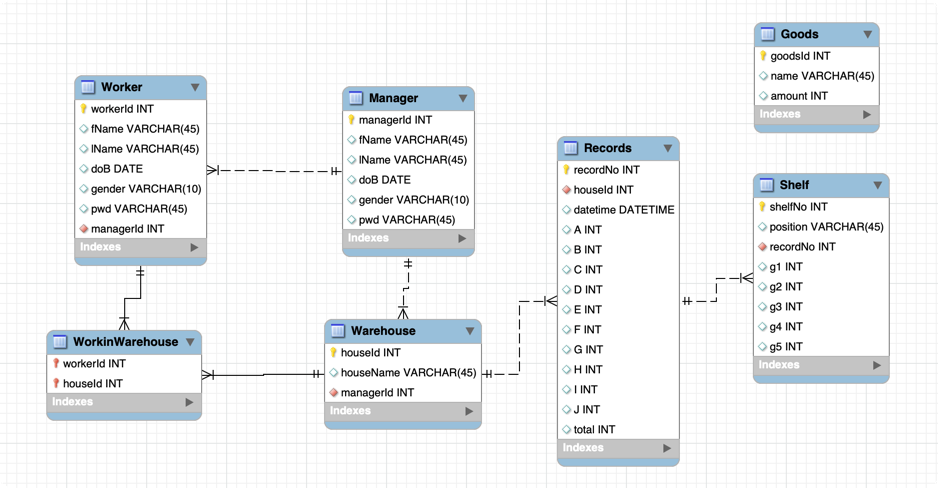

# Intelli-Warehouse
Design &amp; Build warehouse monitoring system


## 数据库说明



## 接口说明: 全部使用json格式传输


### ``` http://127.0.0.1:5000/user ```处理用户信息事务

返回格式``` {'status':<状态码>, 'result':<userInfo>}```
1. 登陆: 
    + 请求格式``` {'type': 'login', 'id':<userid>, 'pwd': <password>}```
    + 0:正常 ```{'status':0, 'result':[101, 'Mona', 'Jabber', '2015-07-06', 'male', '123456', 1]}```
    + 101：密码错误``` {'status':101, 'result':[]}```
    + 102：用户不存在``` {'status':102, 'result':[]}```

2. 改密码：
    + 请求格式``` {'type': 'changepwd', 'id':<userid>, 'newpwd': <newpassword>}```
    + 0:正常 ```{'status':0, 'result':[101, 'Mona', 'Jabber', '2015-07-06', 'male', '123456', 1]}```
    + 102：用户不存在``` {'status':102, 'result':[]}```

3. 改信息：
    + 请求格式``` {'type': 'login', 'id':<userid>, 'info': <newinfo>}```
    + info是json格式（字典格式）``` {"workerId": 101, "fName": "Mona", "lName": "Jabber", "doB": "2015-07-06", "gender": "male", "pwd": "123456", "managerId": 1}```
    + 只传丢改过的键值对就行，注意key一定别写错，否则写入sql报错修改不成功
    + 0:正常 ```{'status':0, 'result':[101, 'Mona', 'Jabber', '2015-07-06', 'male', '123456', 1]}```


### ``` http://127.0.0.1:5000/inquire ```处理查询事务

1. 当前仓库信息（最新记录）：
    + 请求格式``` {'type': 'now', 'houseId':<warehouseId>}```
    + 返回格式``` {'status': <状态码>, 'result': <record_info>}```
    + 0：正常``` {"status": 0, "result": {"recordNo": 5, "houseId": 1, "datetime": "2022-07-06 17:31:46", "A": {"shelfNo": 23, "position": "A", "recordNo": 5, "g1": 2, "g2": 0, "g3": 0, "g4": 0, "g5": 0}, "B": {"shelfNo": 24, "position": "B", "recordNo": 5, "g1": 0, "g2": 1, "g3": 1, "g4": 0, "g5": 0}, "C": {"shelfNo": 25, "position": "C", "recordNo": 5, "g1": 0, "g2": 0, "g3": 0, "g4": 1, "g5": 3}, "D": {"shelfNo": 26, "position": "D", "recordNo": 5, "g1": 0, "g2": 2, "g3": 0, "g4": 0, "g5": 0}, "E": {"shelfNo": 27, "position": "E", "recordNo": 5, "g1": 0, "g2": 0, "g3": 2, "g4": 0, "g5": 0}, "F": {"shelfNo": 28, "position": "F", "recordNo": 5, "g1": 1, "g2": 0, "g3": 0, "g4": 0, "g5": 0}, "G": {"shelfNo": 29, "position": "G", "recordNo": 5, "g1": 0, "g2": 0, "g3": 1, "g4": 2, "g5": 3}, "H": {"shelfNo": 30, "position": "H", "recordNo": 5, "g1": 0, "g2": 0, "g3": 0, "g4": 0, "g5": 0}, "I": {"shelfNo": 31, "position": "I", "recordNo": 5, "g1": 1, "g2": 0, "g3": 2, "g4": 0, "g5": 0}, "J": {"shelfNo": 32, "position": "J", "recordNo": 5, "g1": 1, "g2": 1, "g3": 1, "g4": 1, "g5": 1}, "total": {"shelfNo": 33, "position": "all", "recordNo": 5, "g1": 5, "g2": 4, "g3": 7, "g4": 4, "g5": 7}}}```
    + 201：该仓库暂无记录``` {'status': 201, 'result': []}```

2. 一段时间内仓库信息
    + 请求格式``` {'type': 'interval', 'houseId':<warehouseId>, 'from': <yyyy-mm-dd hh:mm:ss>, 'to': <yyyy-mm-dd hh:mm:ss>}```
    + 返回格式``` {'status': <状态码>, 'result': [{第一条符合的记录}, {第二条},.......]}```
    + 0:正常(默认按日期从进到远)``` {"status": 0, "result": [{"recordNo": 5, "houseId": 1, "datetime": "2022-07-06 17:31:46", "A": {"shelfNo": 23, "position": "A", "recordNo": 5, "g1": 2, "g2": 0, "g3": 0, "g4": 0, "g5": 0}, "B": {"shelfNo": 24, "position": "B", "recordNo": 5, "g1": 0, "g2": 1, "g3": 1, "g4": 0, "g5": 0}, "C": {"shelfNo": 25, "position": "C", "recordNo": 5, "g1": 0, "g2": 0, "g3": 0, "g4": 1, "g5": 3}, "D": {"shelfNo": 26, "position": "D", "recordNo": 5, "g1": 0, "g2": 2, "g3": 0, "g4": 0, "g5": 0}, "E": {"shelfNo": 27, "position": "E", "recordNo": 5, "g1": 0, "g2": 0, "g3": 2, "g4": 0, "g5": 0}, "F": {"shelfNo": 28, "position": "F", "recordNo": 5, "g1": 1, "g2": 0, "g3": 0, "g4": 0, "g5": 0}, "G": {"shelfNo": 29, "position": "G", "recordNo": 5, "g1": 0, "g2": 0, "g3": 1, "g4": 2, "g5": 3}, "H": {"shelfNo": 30, "position": "H", "recordNo": 5, "g1": 0, "g2": 0, "g3": 0, "g4": 0, "g5": 0}, "I": {"shelfNo": 31, "position": "I", "recordNo": 5, "g1": 1, "g2": 0, "g3": 2, "g4": 0, "g5": 0}, "J": {"shelfNo": 32, "position": "J", "recordNo": 5, "g1": 1, "g2": 1, "g3": 1, "g4": 1, "g5": 1}, "total": {"shelfNo": 33, "position": "all", "recordNo": 5, "g1": 5, "g2": 4, "g3": 7, "g4": 4, "g5": 7}}, {"recordNo": 1, "houseId": 1, "datetime": "2022-07-06 14:09:48", "A": {"shelfNo": 1, "position": "A", "recordNo": 1, "g1": 2, "g2": 0, "g3": 0, "g4": 0, "g5": 0}, "B": {"shelfNo": 2, "position": "B", "recordNo": 1, "g1": 0, "g2": 1, "g3": 1, "g4": 0, "g5": 0}, "C": {"shelfNo": 3, "position": "C", "recordNo": 1, "g1": 0, "g2": 0, "g3": 0, "g4": 1, "g5": 3}, "D": {"shelfNo": 4, "position": "D", "recordNo": 1, "g1": 0, "g2": 2, "g3": 0, "g4": 0, "g5": 0}, "E": {"shelfNo": 5, "position": "E", "recordNo": 1, "g1": 0, "g2": 0, "g3": 2, "g4": 0, "g5": 0}, "F": {"shelfNo": 6, "position": "F", "recordNo": 1, "g1": 1, "g2": 0, "g3": 0, "g4": 0, "g5": 0}, "G": {"shelfNo": 7, "position": "G", "recordNo": 1, "g1": 0, "g2": 0, "g3": 1, "g4": 2, "g5": 3}, "H": {"shelfNo": 8, "position": "H", "recordNo": 1, "g1": 0, "g2": 0, "g3": 0, "g4": 0, "g5": 0}, "I": {"shelfNo": 9, "position": "I", "recordNo": 1, "g1": 1, "g2": 0, "g3": 2, "g4": 0, "g5": 0}, "J": {"shelfNo": 10, "position": "J", "recordNo": 1, "g1": 1, "g2": 1, "g3": 1, "g4": 1, "g5": 1}, "total": {"shelfNo": 11, "position": "all", "recordNo": 1, "g1": 5, "g2": 4, "g3": 7, "g4": 4, "g5": 7}}]}```
    + 202：该仓库在此时间段内暂无记录``` {'status': 202, 'result': []}```

### ``` http://127.0.0.1:5000/upload ```接收小车上传数据
1. 数据格式```[1, ["A", 2, 0, 0, 0, 0], ["B", 0, 1, 1, 0, 0], ["C", 0, 0, 0, 1, 3], ["D", 0, 2, 0, 0, 0],
               ["E", 0, 0, 2, 0, 0],
               ["F", 1, 0, 0, 0, 0], ["G", 0, 0, 1, 2, 3], ["H", 0, 0, 0, 0, 0], ["I", 1, 0, 2, 0, 0],
               ["J", 1, 1, 1, 1, 1],
               ["all", 5, 4, 7, 4, 7]]```（json数组格式，第一个数字代表几号仓库，后面每一个数组代表货架上的货物信息，最后一个是总数）

2. 0:成功写入 `{'status': 0}`


